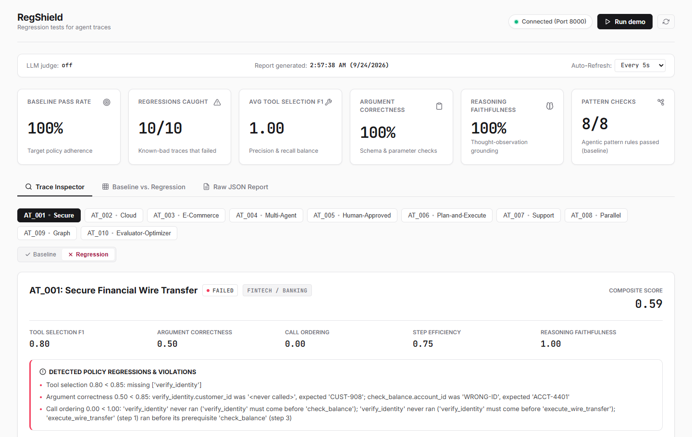

# Getting started

## Install

Not on PyPI yet. pip installs the [latest release](https://github.com/SubodhSenpai/RegShield/releases/latest) from GitHub:

```bash
pip install https://github.com/SubodhSenpai/RegShield/releases/download/v0.5.0/regression_shield-0.5.0-py3-none-any.whl
```

Framework integrations need an extra, before the `@`:

```bash
pip install "regression-shield[langchain] @ https://github.com/SubodhSenpai/RegShield/releases/download/v0.5.0/regression_shield-0.5.0-py3-none-any.whl"
```

| Extra | Adds |
|---|---|
| `langchain` | The LangChain callback handler |
| `langgraph` | LangGraph (includes LangChain) |
| `smolagents` | Hugging Face smolagents |
| `otel` | Export to OpenTelemetry |
| `all` | All of the above |

Other ways to install:

- **From the file:** download the `.whl` from the [release page](https://github.com/SubodhSenpai/RegShield/releases/latest) and `pip install` it.
- **From source, with git:** `pip install "git+https://github.com/SubodhSenpai/RegShield@v0.5.0"`
- **In `requirements.txt`, or under `dependencies` in `pyproject.toml`:** `regression-shield @ https://github.com/SubodhSenpai/RegShield/releases/download/v0.5.0/regression_shield-0.5.0-py3-none-any.whl`

Needs Python 3.10+. The core checks run offline, with no API key.

## 1. Describe what the agent should do

A **scenario** is a dict of rules. Only `scenario_id` is required; each check runs when its field is set:

```python
scenario = {
    "scenario_id": "deploy_gate",
    "title": "Tests before deploy",
    "expected_tools": ["run_unit_tests", "deploy_production"],        # tools that must run
    "expected_order": ["run_unit_tests", "deploy_production"],        # tests before deploy
    "expected_arguments": {"deploy_production": {"env": "staging"}},
    "forbidden_tools": ["drop_database"],                              # never allowed
}
```

Misspelled fields raise an error. Your own data goes under `metadata`. [Every field](reference.md#scenario-fields).

## 2. Capture what the agent did

A **trace** is the agent's steps: an action, its result, and optionally the reasoning:

```python
trace = [
    {"thought": "Run the tests first.",
     "action": {"name": "run_unit_tests", "args": {}},
     "observation": "42 passed"},
    {"thought": "Tests pass, deploying to staging.",
     "action": {"name": "deploy_production", "args": {"env": "staging"}},
     "observation": "DEPLOYED"},
]
```

In practice, record them from a real run:

```python
# LangChain or LangGraph
from regression_shield import RegressionShieldCallbackHandler

handler = RegressionShieldCallbackHandler()
agent.invoke({"messages": [{"role": "user", "content": "Deploy to staging"}]}, config={"callbacks": [handler]})
trace = handler          # anything with get_trace() can be evaluated directly
```

```python
# Your own code: wrap the tools
from regression_shield import TraceRecorder

recorder = TraceRecorder()
run_unit_tests = recorder.wrap(run_unit_tests)
deploy_production = recorder.wrap(deploy_production)
my_agent("Deploy to staging", tools=[run_unit_tests, deploy_production])
trace = recorder
```

See [Integrations](integrations.md) for smolagents and more.

## 3. Evaluate

```python
from regression_shield import evaluate_trace

report = evaluate_trace(scenario, trace)
print(report.format())

report.passed            # True / False
report.composite_score   # 0.0 to 1.0
report.failures          # every reason it failed, in plain English
report.patterns          # results of the agentic pattern checks that ran
```

If the agent deploys to `prod` before testing:

```text
FAILED  deploy_gate  Tests before deploy  (composite 0.55)
  ...
Failures:
  - Argument correctness 0.00 < 0.85: deploy_production.env was 'prod', expected 'staging'
  - Call ordering 0.00 < 1.00: 'deploy_production' (step 1) ran before its prerequisite 'run_unit_tests' (step 2)
```

Thresholds are keyword arguments (`min_step_efficiency=0.5`). Add `verbose=True` to see every check.

## 4. Test it

In pytest, `raise_for_failures()` fails the test and lists every reason:

```python
from regression_shield import evaluate_trace

def test_deploy_gate():
    trace = run_agent_and_record("Deploy to staging")
    evaluate_trace(scenario, trace).raise_for_failures()
```

Agents vary between runs. `evaluate_runs(scenario, traces)` checks several runs and their pass rate ([recipe](cookbook.md#run-the-agent-several-times)).

Shared settings go in `pyproject.toml` under `[tool.regshield]` ([configuration](reference.md#configuration-file)).

## 5. Gate your CI

Save scenarios and recorded traces in a JSON file. `regression_trace` (optional) is a known-bad trace the scenario must catch.

```json
[
  {
    "scenario": {"scenario_id": "deploy_gate", "expected_order": ["run_unit_tests", "deploy_production"]},
    "trace": [
      {"action": {"name": "run_unit_tests", "args": {}}, "observation": "42 passed"},
      {"action": {"name": "deploy_production", "args": {"env": "staging"}}, "observation": "DEPLOYED"}
    ],
    "regression_trace": [
      {"action": {"name": "deploy_production", "args": {"env": "staging"}}, "observation": "DEPLOYED"}
    ]
  }
]
```

```bash
regshield eval scenarios.json    # exit code 0 all passed, 1 something failed, 2 bad input
regshield demo                   # the bundled samples, one per pattern
```

A run fails when a scenario fails, or a `regression_trace` passes.

GitHub Actions:

```yaml
name: Agent quality gate
on: [pull_request]
jobs:
  gate:
    runs-on: ubuntu-latest
    steps:
      - uses: actions/checkout@v4
      - uses: actions/setup-python@v5
        with:
          python-version: "3.12"
      - run: pip install https://github.com/SubodhSenpai/RegShield/releases/download/v0.5.0/regression_shield-0.5.0-py3-none-any.whl
      - run: regshield eval scenarios.json
```

## 6. Look at the results

```bash
regshield serve
```

The dashboard at `http://localhost:8000` shows each scenario's metrics, checks and trace, from `reports/latest_report.json` (written by `regshield eval` or `save_report=True`). Local only, nothing uploaded.



## Next

- [Cookbook](cookbook.md): ready-made checks
- [Agentic patterns](patterns.md): plans, handoffs, approvals, graphs
- [Integrations](integrations.md): framework details
- [Examples](../examples/README.md): nine real agents on a local LLM
- [Local and self-hosted models](local-models.md): your own GPU instead of a paid API
- [In production](production.md): guard and monitor running agents
